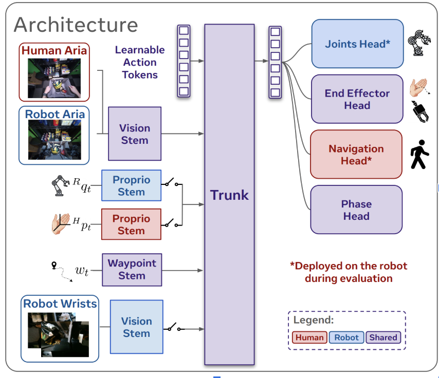

# [arxiv](https://arxiv.org/abs/2509.04443)

# Notes on EMMA: Scaling Mobile Manipulation via Egocentric Human Data

## Introduction

* paragraph 1
    * mobile manipulation is challenging since it requires both navigation and manipulation
    * primary issue: data scarcity in teleoperation frameworks for mobile manipulation (ex. Mobile ALOHA). 
    * as a result, limited dataset diversity and unreliable in real world settings
* paragraph 2
    * XR wearables (smartglasses) are cheap, don't require another bot for teleoperation, and are easy to collect data for
    * so far, cross-embodiment learning tasks have mainly been restricted to table top manipulation
* paragraph 3
    * EMMA trains mobile manipulation policies from robot static manipulation and human mobile manipulation data
    * human mobile manipulation data comes from Meta's Project Aria glasses
* paragraph 4
    * EMMA presents a full stack framework
        * Action retargeting pipeline (translates human mobile movements into robot differential drive commands)
        * unified architecture (a core ML model that's designed to train on both human and robot data)
        * phase identification mechanism (intelligently switches the robot between navigation and manipulation mode)
* paragraph 5
    * EMMA achieves superior performance compared to baselines trained on teleoperated mobile robot data
    * additional human data outperforms teleoperated robot data
    * EMMA can transfer navigation and manipulation skills to environments only seen in human demonstrations

## Related Work

paragraph 1: Behavior Cloning

* behavior cloning is a subset of imitation learning
* policies are trained with direct supervised learning (data has labels) from expert demonstrations
* most success and progress so far in this frontier has been with static manipulation tasks

paragraph 2: Learning for Mobile Manipulation

* building on the success of the aforementioned static manipulation tasks, people have begun exploring learning-based approaches for mobile manipulation
* End to end imitation learning is unlike the approaches taken in these recent works. End to end imitation learning enables mapping raw pixel information to whole-body actions
    * this approach has shown promising results through large-scale training
    * many works have tried to develop new ways to facilitate data collection, such as VR headsets, motion-capture suits, and full-body teleoperation
    * executing these at scale is difficult, which is where egocentric human data from wearable devices comes in

paragraph 3: Robot Learning from Human Data

* techniques used to approach mobile manipulation
    * manipulation
        * co-training on egocentric human data and robot demonstrations
        * zero or few shot transfer through image inpainting (digitally editing human videos) or motion tracking to guide the robot
        * hierarchical planners (watch human video, then translate high level goals from the video into specific joint movements)
    * navigation
        * combining imitation learning with reinforcement learning
* EMMA offers a unified learning framework, unlike the techniques mentioned before (which were only focused on manipulation or navigation)

## Hardware and Data Preliminaries

paragraph 1: Egocentric Data Collection

* Meta Project Aria smartglasses are used
* high perception capabilities thanks to the Machine Perception Service offered by Meta. This service allows the capture of both exteroception and proprioception data.

paragraph 2: Low-cost Bimanual Mobile Manipulator

* the system must somewhat resemble human proportions and kinematic workspaces
* the arms are two 6-DoF ViperX 300s on a height adjustable rig
* the arm rig is mounted on a differential drive capable of moving 2m/s
* Aria glasses are mounted in a position that resembles human eyes, reducing the sensor-manipulator kinematic gap
* each arm is equipped with an Intel Realsense D405 on its wrist

paragraph 3: Human and Robot Data Streams

* human demonstration data stream $\mathcal{D}_H$
* robot execution data stream $\mathcal{D}_R$
* shared egocentric RGB image data stream $I_{ego}$ from the glasses on the human or robot
* RGB image data stream from two wrist cameras $I_{wrist}$
* proprioception
    * human proprioception, MPS is used to capture
        * bimanual 3D hand poses $H_p \in SE(3) \times SE(3)$
        * 3D head pose $H_d \in SE(3)$
    * robot proprioception
        * bimanual arm joint positions (includes gripper state) $R_q \in \mathbb{R}^{2 \times 7}$
        * end effector poses $R_p \in SE(3) \times SE(3)$

paragraph 4

* navigation
    * human head pose $H_d$ is extracted to 2D base pose representations
        * 3D head pose is projected onto the ground plane to get the 2D position and yaw angle at time t: $h_t^{base} = (x_t, y_t, \theta_t) \in SE(2)$
    * Displacement-based waypoint history $W_t = \{h_{t-k_i}^{base}\}_{i=1}^{K_h}$
        * $K_h$ is the maximum number of historical waypoints
    * New waypoints are added when the displacement crosses the threshold (ex. every 0.5m)
        * this ensures consistent spatial resolution regardless of movement speed
    * For policy learning, the waypoints are transformed into the current egocentric frame
        * $W_t = \{T_{ego}^{-1} * h_{t-k_i}^{base}\}_{i=1}^{K_h}$, where $T_{ego}$ is the transformation from world to current egocentric coordinates
    * In other words, human egocentric data generates 2D ground plane world coordinates (ex. x=10m, y= 3m, theta = 60 deg) waypoints. Each waypoint $h_{t-k_i}^{base}$ represents the human's position at some previous time, taken every time the human passes the displacement threshold. For the robot to use these waypoints, they need to be in the robot's current perspective. $T_{ego}^{-1}$ converts the waypoints from world coordinates to relative positions (ex. 2m ahead, 1m left) to where the human glasses are.

## EMMA: System And Algorithm

paragraph 1

* EMMA is a full stack system, which includes
    * 1) Direct transfer of navigation skills from egocentric human data to the mobile manipulator
    * 2) scaling up of full mobile manipulation policy performance by co-training on human (mobile) and robot (static) data

### Part A: Data Retargeting and Alignment

paragraph 1

* A primary issue lies in embodiment gaps between human data and the robot's physical structure (ex. navigation: humans can move omnidirectionally, this robot can't; manipulation: human hand motions are different from robot end effector motions)
* To mitigate this issue for navigation and manipulation, EMMA introduces retargeting and alignment strategies

paragraph 2,3: Bridging Navigation Kinematic Gap

* As mentioned previously, project human 3D head pose onto the ground plane to extract 2D base poses, then turn these poses into waypoints that capture the human's path.
* however, these waypoints are sometimes not feasible for the robot to follow due to the omnidirectionality of human movement
* solution: turn the waypoints into an optimization problem
    * given a sequence of waypoints (from the human trajectory), find velocity commands that minimize position error, heading error, and change in linear/angular velocity between steps. Also do so while being subject to a set of differential-drive dynamics

paragraph 4: Aligning Manipulation Action Data

* same approach as EgoMimic
    * overview: to make the human and robot manipulation data comparable for learning, all actions are first converted into a consistent first-person camera perspective and then statistically normalized to account for inherent differences in their movements
    * unify coordinate frames by transforming all upper-body action chunks (from both the human and the robot) into the reference frame of the camera at the time of observation
        * In simpler terms:
            * convert every action into the reference frame of the glasses: The moment an action is performed, make the camera the origin. All actions are then re-calculated relative to that camera-centric viewpoint. As a result, the model receives a consistent stream of data on how to move the end-effectors, regardless of whether the demonstration came from a human or a robot
    * Z-score normalization
        * human data is rescaled based on the average human motion, and the robot data is rescaled based on the average robot motion
        * Both datasets are now on a common statistical scale, making it easier for the model to learn

### Part B: Human and Robot Data Co-Training

paragraph 1

* goal of EMMA: transfer knowledge from egocentric human mobile manipulation data, while still leveraging limited static robot manipulation data for precise manipulation steps
* Despite the retargeting and alignment efforts in the previous section, there's still a large domain gap between the two data sources. Therefore, a unified learning framework capable of processing heterogeneous data sources is required.
* architecture is designed based on a decoder-only Transformer, including stems, a shared trunk, and multiple action and auxiliary output heads
* The goal of the co-training is for the final action predicted by the Heads to match the expert action from the training data as closely as possible

paragraph 2: Stems

* stems are shallow neural networks (NNs with only a few hidden layers)
* preprocess raw sensor data
* vision stem is shared between human glasses rgb data and robot glasses rgb data
    * vision stem learns to recognize edges, textures, and objects that are relevant for the task
* take the raw sensor data (pixels from a camera, joint angles from the robot) and learn the best way to extract and package the most important features

paragraph 3: Trunk

* processes the concatenate token sequences from all active stems
* fuses them into a high level understanding of the situation
* LLM understanding of Learnable action tokens: After the Trunk has fused all the sensory information to understand the current situation, the final outputs that correspond to these initial token "slots" represent the model's prediction of what actions to take over a future time horizon. The Heads then take these specific outputs and decode them into concrete robot movements. Essentially, they are a mechanism to tell the transformer architecture, "Use all the information you've just processed to fill in these blanks with a plan of action."

paragraph 4: Heads

* MLPs (Multilayer Perceptrons), AKA feedforward neural network
* Receive high level understanding from the trunk and learn how to decode it into specific actions
    * ex. the Joints head learns "when the Trunk's summary looks like this, I need to output these specific joint angles to grab the cup"

### Part C: Auxiliary Phase Identification and Control Modulation

paragraph 1:

* mobile manipulation tasks naturally alternate between navigation and manipulation phases
* EMMA introduces an unsupervised phase identification mechanism

paragraph 2: Phase Detection

* phases are identified based on motion dynamics
* calculate hand velocity to head velocity ratio
    * manipulation have a high hand to head activity ratio
    * navigation has a low hand to head activity ratio

paragraph 3: 

* cluster head positions from manipulation periods using a Gaussian Mixture Model, identifying the primary manipulation zones in the environment
* any frame in which the robot is in one of these zones is identified as a manipulation phase, and all others are classified as a navigation phase

paragraph 4:

* if the system is in a manipulation phase, suppress navigation commands
* if in a navigation phase, keep the arms in a safe, neutral position until reaching the next manipulation zone

## Experiments

paragraph 1:

* goal: validate 3 key hypotheses
    * H1: EMMA can achieve performance comparable to system trained on teleoperated mobile manipulation data
    * H2: EMMA's design decisions improve downstream task performance
    * H3: Given starting static robot manipulation data, it is more valuable to collection additional human mobile manipulation data over mobile robot teleoperation data
* these hypotheses are evaluated through three long horizon mobile manipulation tasks

paragraph 2: Table Service

* pick up wrapped utensils from the dining table, navigate to the dining table, and place the utensils on the left side of the dining table
* go back to the kitchen table, place a croissant on the plate, and navigate back to place the plate in the center of the dining mat

paragraph 3: Handover Wine

* pick up a randomly placed wine glass on a table
* hand the wine glass to a human standing nearby in a 3m x 3m area

paragraph 4: Grocery shopping

* grab a juice pouch and a chip bag from a shelf and place them in a shopping bag
* use both arms to pick a popcorn bag from the shelf and add it to the bag
* lift the shopping bag and navigate to the table behind it

paragraph 5: baselines

* comparison is mainly against Mobile ALOHA, which uses expensive mobile robot teleoperation data

paragraph 6

* two ablation baselines
    * EMMA without action retargeting, find out if the kinematic alignment is necessary
    * EMMA without phase identification, find out if switching modes is necessary
* 50 trials conducted per task/model variant configuration, record error bars with 95% confidence interval
* each trial has a maximum duration of 2 minutes

### Main Results

paragraph 1: EMMA achieves favorable performance compared to system trained on teleoperated mobile robot data (H1)

* Handover Wine task achieved an 82% success rate (30% more than Mobile ALOHA)
* Also showed improvement in the Grocery Shopping task
* comparable performance in the Table Service task

paragraph 2: EMMA generalizes to unseen scenes

* EMMA achieves a 54% success rate given 30 minutes of human demonstrations in a new spatial layout (human standing in a 5m x 2m area rather than a 3m x 3m area, this new area was not seen in the robot data), this shows
    * navigation behaviors learned from human data adapt to the expanded spatial configuration
    * manipulation skills remain robust to visual domain shifts
* Mobile ALOHA is much worse at this generalization

paragraph 3: Ablation Studies (H2)

* without kinematic retargeting, the success rate of Handover Wine drops by 30%
    * the robot loses track of the human recipient when executing kinematically infeasible trajectories
* without phase identification, the system completely fails the Handover Wine task

paragraph 4: Human data scales mobile manipulation performance more efficiently compared to teleoperated robot data (H3)

* increasing human mobile manipulation data improved EMMA's success rate from 0.36 to 0.82
* increasing robot teleoperation improved Mobile ALOHA's success rate from 0.26 to 0.52
* qualitatively, EMMA also showed better target pose and fewer collisions with the environment
* takeaway: additional human mobile manipulation yield greater returns

## Conclusion

paragraph 1

* EMMA introduces a framework that enables mobile manipulation without requiring expensive robot mobile teleoperation data
* EMMA outperforms mobile ALOHA with equivalent data collection times and has superior scaling properties
* kinematic retargeting and phase identification are integral to end goal performance
* Provided solid evidence that mobile manipulation performance can be scaled with egocentric human data