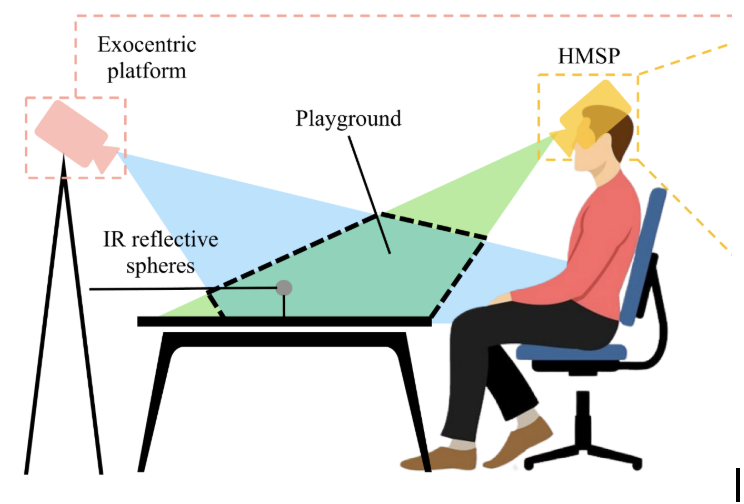
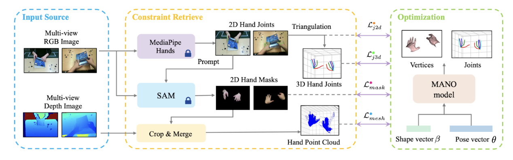
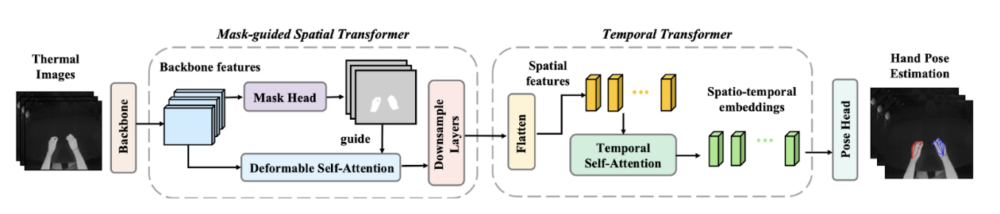

# [arxiv](https://arxiv.org/abs/2403.09871)

# Notes on ThermoHands: A Benchmark for 3D Hand Pose Estimation from Egocentric Thermal Images

## Abstract

paragraph 1

* We need robust egocentric 3D hand pose estimation systems
* previous approaches use RGB or Near Infrared (NIR), these struggle with lighting variations, obstacles such as handwear, and NIR techniques can be disrupted by sunlight
* ThermoHands introduces the first benchmark focused on thermal image-based egocentric 3D hand pose estimation
    * includes a multi-view and multi-spectral dataset collected from 28 subjects performing various tasks
    * This dataset is accurately annotated with 3D hand poses
* Also introduces TherFormer, a new baseline method (foundational model for a new problem)
    * TherFormer uses a dual transformer module for egocentric 3D hand pose estimation
    * Shows good performance, affirms thermal imaging’s effectiveness in estimating 3D hand pose

## Introduction

paragraph 1

* EgoCentric 3D hand pose estimation is important for many applications including imitation learning and XR experiences
* Developments such as the Meta Quest and Apple Vision Pro emphasize this importance

paragraph 2

* RGB is vulnerable to lighting issues and occlusions caused by handwear, ex. gloves
* NIR is power intensive and vulnerable to sunlight and other NIR-equipped devices

paragraph 3

* Thermal imaging cameras eliminate reliance on the visible light spectrum
* The hand’s structure is created through differences in temperature meaning, lighting variation is no longer an issue
* hands can be detected even under handwear

paragraph 4

* ThermoHands is the first benchmark specifically designed for egocentric 3D hand pose estimation using thermal imaging
* ThermoHands includes a dataset consisting of thermal, NIR, depth, and RGB images. These are all taken from the customized head-mounted sensor platform (HMSP)
    * 28 participants in the dataset, each participant performs hand-object and hand-virtual interaction activities
    * data is gathered under 5 scenarios, each one has varying environments, handwear, and lighting 
* To circumvent manually annotating all of the 3D hand poses, they developed an automated annotation pipeline (described in section 4. Hand Pose Annotation), which efficiently generates 3D hand pose ground truths through optimization based on the MANO model

paragraph 5

* TherFormer is a new baseline method designed for thermal image-based egocentric 3D hand pose estimation
* uses two consecutive transformer modules (mask-guided spatial transformer and temporal transformer), encode spatio-temporal relationship for 3D hand joints without losing computational efficiency

paragraph 6

* validation process begins with verifying the annotation quality
* then, benchmark TherFormer against leading methods
* summary of contributions
    * introduce a novel benchmark (ThermoHands) to investigate the potential of thermal imaging for egocentric 3D hand pose estimation
    * collection of a diverse dataset of around 96,000 multi-spectral (from NIR, rgb, thermal) images from 28 participants 
    * Introduce TherFormer, a new baseline method (a model that provides a point of comparison for more complex models)
    * experiments based on the ThermoHands benchmark and analysis on TherFormer and other SOTA methods
    * Release of the dataset, code, and models at [https://github.com/LawrenceZ22/ThermoHands](https://github.com/LawrenceZ22/ThermoHands)

## Related Works

### 3D Hand Pose Datasets

paragraph 1

* existing datasets with 3D hand pose annotations can be summarized as four types
    * marker-based, synthetic, manual or hybrid, and automatic annotated datasets
* marker-based approaches use magnetic sensors or mocap markers, but they can cause bias  to the hand appearance
* synthetic data suffers from the sim to real gap in terms of fluid motion and texture
* full or part human annotation is too costly
* automatic annotated datasets is what this work leverages. This method uses pre-trained models to infer the hand information and relies on optimization to fit the MANO hand model

paragraph 2

* previous datasets only provide depth images, RGB images, or both. None include NIR or thermal image based 3D hand pose estimations
* the work captures bimanual actions from both an egocentric and exocentric viewpoint (as seen in the image below)
* 

### Image-based 3D Hand Pose Estimation

paragraph 1

* 3D hand pose estimation has been largely investigated from an RGB and depth image viewpoint
* These investigations can be categorized into two fashions
    * model-based methods: use prior knowledge of the MANO hand model
    * model-free methods: learn the direct regression of 3D hand joints or vertices coordinates
* There has been a rise in using time / sequential images as input for 3D hand pose estimation
* This study evaluates existing methods and the baseline method in single image-based and video-based problem settings

### Thermal Computer Vision

paragraph 1

* thermal cameras capture the radiation in the LWIR spectrum and deduce the temperature distribution on the surfaces
* thermal technology has been tried in many other computer vision works, but not as much for 3D hand pose estimation

## The ThermoHands Benchmark

### Multi-Spectral Hand Pose Dataset

paragraph 1: Overview

* the core of the benchmark is a multi-spectral dataset for 3D hand pose estimation
* developed a customized head-mounted sensor platform (HMSP) and an exocentric platform to record multi-view data
* four auxiliary parts are also recorded during capture
    * under the darkness, under sun glare, with gloves on the hand, and in the kitchen with different actions

paragraph 2: Sensor Platforms

* HSMP has three major components
    * a cushion for comfort
    * a base component that provides 30-degree downward tilt
    * a sensor board that carries an Intel RealSense LiDAR camera for RGB, depth, and NIR images and a Teledyne LWIR camera for thermal images
* An exocentric platform is equipped with an Intel RealSense D455 to support multi-view annotation
* two depth sensors are placed outside each other’s FOV to minimize NIR interference

paragraph 3: Synchronization

* a single PC simultaneously gathers data streams from two sensor platforms
* post-processing: after collection, the six different types of images are synchronized with respect to the timestamps of the thermal images
    * Egocentric RGB, thermal, depth, NIR
    * Exocentric RGB, depth

paragraph 4: Egocentric Calibration

* to accommodate calibration of the thermal camera, they designed a modular calibration chessboard
    * very cool solution: they created a chessboard in which the black pieces were fixed and the white tiles could be removed. The black tiles are cooled down while the white tiles remain at room temperature
    * as a result, all three spectra can be calibrate 

paragraph 5: Cross-View Calibration

* to calibrate the cameras between the egocentric and exocentric viewpoints
    * placed 11 IR reflective spheres that are visible from both viewpoints
    * had to manually annotate the positions of the spheres in the first frame because automatic detection was too inaccurate at the beginning
    * Using the known 3D positions of the spheres from the egocentric depth image, they could then compute the transformation between the two viewpoints
* For subsequent frames, only the pose of the egocentric camera is needed since the exocentric platform is kept stationary. This was done using a SOTA odometry method called KISS-ICP
    * KISS ICP analyzes point clouds from the depth camera to track the egocentric camera’s motion

paragraph 6: Dataset Statistics

* most images are from the normal office scenario, in which each participant performs 7 hand-object interactions:
    * cut paper, fold paper, pour water, read book, staple paper, write with pen, write with pencil
* also collected 5 hand-virtual interactions with two hands
    * pinch and drag, pinch and hold, swipe, tap, touch
* split into training, validation, and testing with 4:1:2
* also asked one subject to do all 12 aforementioned actions in different settings (darkness, sun, gloves on)
* two subjects were also asked to perform 7 scenario-specific interactions in the kitchen
    * cut, spray, stir, wash hands, wash mug, wash plate, wipe

## Hand Pose Annotation

paragraph 1

* to avoid tedious manual annotation, they implement a fully automatic annotation pipeline to obtain the 3D hand pose ground truth for the dataset
* The MANO statistical hand model is used to represent 3D hand pose, it acts like a digital puppet hand, controlled by shape and pose parameters
* by adjusting the shape (shape of the hand) and hand pose parameters, they make the digital MANO hand perfectly match the shape and pose of a real person's hand in their videos, giving them precise 3D annotation data
* the overall goal is to have the MANO hand perfectly overlap with the real hand in the videos

paragraph 2: Initialization

* For the first frame of a sequence, the MANO shape and pose are adjusted to get a match with the video’s hand (this is done by minimizing the optimization objective for each hand, resulting in a good fitting for MANO)
* For all frames after the first, the final pose from the previous frame is used as the starting guess for the current frame. The shape parameters stay constant

paragraph 3: 2D Joint Error

* MediaPipe Hands automatically detects the 2D locations of the hand joints from both camera views
* These 2D joint locations are then compared to the 2D project of the MANO hand’s joints
* system adjusts MANO pose to mitigate resulting error

paragraph 4: 2D Mask Error

* 2D joint locations are fed into SAM (Segment Anything Model) to generate a 2D outline of the hand in the image
* system checks how well the 2D outline of the hand fits the 3D MANO hand
* system adjusts MANO pose to mitigate resulting error

paragraph 5: 3D Joint Error

* triangulate the 2D joints to transform into 3D joints, calculate error between this and MANO hand
* system tries to minimize this error

paragraph 6: 3D Mesh Error

* using the 2D hand mask and the depth camera data, create a point cloud that represents the visible surface of the real hand. optimize the MANO hand further to fit the shape of the real hand

paragraph 7: Regularization

* constrain the joint angles to remove irregular hand articulations

note: all error terms from paragraph 2 to 7 are combined into one optimization objective: minimize all of these errors. How the optimization system works: Initial guess for hand pose and shape in the first frame. Then, measure all errors based on the descriptions from paragraphs 2 to 7. Calculate total error, and intelligently adjust pose and shape to lower total error. Then repeat. 

## TherFormer: A Baseline Method

paragraph 1

* TherFormer is the baseline method
    * utilizes two consecutive transformer modules to model the spatio-temporal relationship of hand joints while also being computationally efficient
* consider two problem settings:
    * single image based 3D hand pose estimation
        * aim to capture 3D joint positions for two hands given the single thermal image
    * video based 3D hand pose estimation
        * input is a sequence of thermal images, estimate the per-frame 3D hand joint positions
* The network architecture for the video-based setting (TherFormer-V) is presented, but it can easily be adapted to the single image based version by setting T = 1

paragraph 2: Mask-guided Spatial Transformer

* the mask head looks at the thermal image and quickly generates a rough mask of where it thinks the hands are. This mask is then used to guide the attention mechanism. Instead of analyzing every single pixel in the image equally, it pays attention only to the pixels inside and immediately around the hand stencil
* attention allows the model to assign importance to only the most important parts of the input data, like the brain emphasizing words in a sentence. For an image, this would be assigning an importance score to each pixel. However, this becomes computationally expensive very quickly. A better approach in this case is deformable self attention: only look at a fixed number of key locations
* This approach reduces computational waste and increases the robustness of the system against background clutter

paragraph 3: Temporal Transformer

* Temporal information is important for 3D hand pose estimation when dealing with occlusion
* for each frame in the sequence, the model gets the spatial information from the previous module
* temporal self-attention: for any given frame, it looks at all the other frames in the sequence and decides which ones are most important for understanding the current hand pose. The final output  now contains not only spatial information but also context about how the hand was moving, ensuring a better final pose estimate

## Experiment

### Evaluation of the Annotation Method

* first validate accuracy of the 3D hand pose annotation
* for evaluation, manually annotate two random sequences from the main dataset
    * first annotate the 2D joint locations from two viewpoints and obtain the 3D joint locations by triangulation 
    * calculate the average 3D joint eros across all frames
* the automatic annotation method achieved an average joint error of ~1cm
    * remarkably better than ego-view only optimization, demonstrates need for a multi-view setup

### Experiment Setup

paragraph 1: Dataset Preparation

* Main part of the dataset is automatically annotated using the Hand Pose Annotation system described in section 4
* However, some parts are unable to be automatically annotated (ex. darkness, gloves), so they annotated a few of these sequences manually

paragraph 2: Method and Implementation

* three SOTA 3D hand pose estimation methods (HTT, A2J-Transformer, and HaMeR) were used for comparison
* All trained models are tested on a single NVIDIA RTX 4090 GPU

paragraph 3: Evaluation Metrics

* Percentage of Correct Keypoints (PCK)
* Mean End-Point Error (MEPE) - average distance between the predicted locations of all hand joints and their actual ground-truth locations

### Thermal Image-based Results

paragraph 1: Main Results

* TherFormer-S outperforms three competing methods
* TherFormer-V outperforms HTT given the same sequential images
* The improvement comes from the mask-guided spatial attention design
* There’s a gap in performance between HTT and TherFormer’s video modes and single image modes, this is likely due to the lack of temporal information, which gives a large boost in occlusion cases
* TherFormer is also highly efficient to run, and TherFormer-V improves performance over HTT for other spectra

paragraph 2: Ablation Studies

* ablate the mask-guided attention mechanism and the entire spatial transformer
* the ablation of either decreases TherFormer’s performance

paragraph 3: Impact of Sequence Length

* Performance generally improves with increased sequence length
* Slight performance decrease in the camera space (tracking global position of the hands) when increasing the sequence length to 16

### Comparison between Spectrum

paragraph 1: Qualitative Results under Challenging Conditions

* to intuitively show results, qualitative analyses of the multi-spectra performance between different methods (ex. HTT) are conducted

paragraph 2: RGB vs. Thermal

* rgb fails with gloves and in darkness, thermal did well

paragraph 3: NIR, Depth vs. Thermal

* NIR sensors did terribly in sunlight, throwing everything off. Thermal still did well

paragraph 4: Quantitative Results under Challenging Conditions

* thermal performs the best all around, rgb does badly with handwear, and NIR performs poorly under sunlight 

paragraph 5: Quantitative Results under Normal Conditions

* depth image-based methods performed the best, outperforming thermal under normal conditions
* NIR shows a marginal decrease in performance but is still better than rgb and thermal
* Thermal’s performance was comparable to rgb, showing that it can be still be a viable alternative even in normal conditions

## Limitation and Future Work

paragraph 1

* the dataset mainly focused on controlled indoor environments and challenging scenarios for RGB/NIR
* there’s a lack of data of challenging scenarios for thermal imaging, which they plan to expand the dataset for later
    * ex. include grabbing hot or cold objects, or more outdoor environments in which it’s harder to thermally differentiate between hand and environment
* another limitation / future possibility: only 3D hand poses are annotated right now, but finer actions (ex. reach, grasp, lift) could be annotated, making this work useful for even more research tasks related to the human hand

## Conclusion

* ThermoHands is the first benchmark for egocentric 3D hand pose estimation using thermal images
* it features a multi-spectral, multi-view dataset with automatically annotated 3D hand poses
* it also features a novel baseline method, TherFormer, for encoding spatio-temporal relationships by utilizing dual transformer modules
* TherFormer outperforms existing methods in thermal-based 3D hand pose estimation by demonstrating near 1cm annotation accuracy (even in challenging occlusion and lighting scenarios)
* In machine learning research, a benchmark consists of two things: a standard dataset and a standard way to measure performance on it (an evaluation metric)
* By being the first model to be officially tested on the new ThermoHands dataset, TherFormer's performance sets the first "high score" that future models will have to beat
    * annotation is the “answer key” in the benchmark